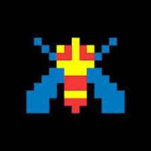
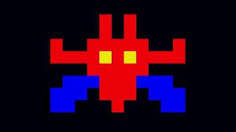
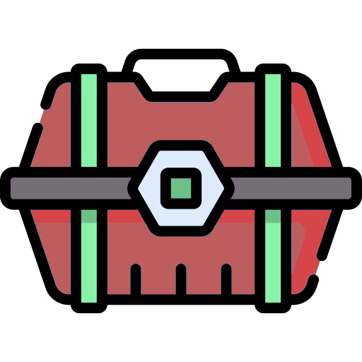
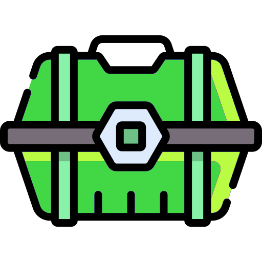
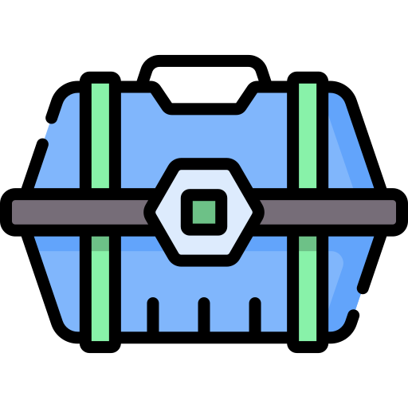

# Galaga Java Final Project

## Summary
This Galaga is based on the code Professor Gerber provide on [Github](https://github.com/agerber/proJava/tree/master/src/main/java/edu/uchicago/gerber/_08final). It is very similar to traditional galaga. However, due to time limit, I don't have chance to update all the enemy in the game.

## How to play the game
You can control the space racket using the arrow keys. It will fire automatically, so your main task is to maneuver it and avoid being shot by the enemy. 

## Enemy

There are two types of enemies: Bees and Bosses. 

A Bee shoots a single bullet at a time and moves randomly.

A Boss fires from multiple directions, and upon defeat, it spawns three Bees from its body.

## LootBox

There are also three types of supply boxes: fire, nuke, and shield boxes. Each of these boxes provides a power-up corresponding to its name. Acquiring these boxes can be very helpful in combat. 

You have only three lives in each game, so play safely and enjoy!